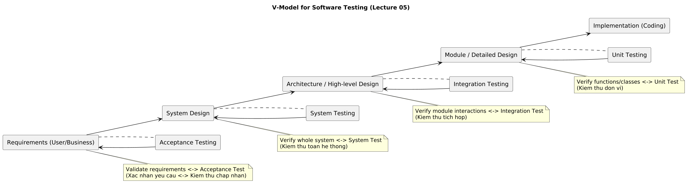
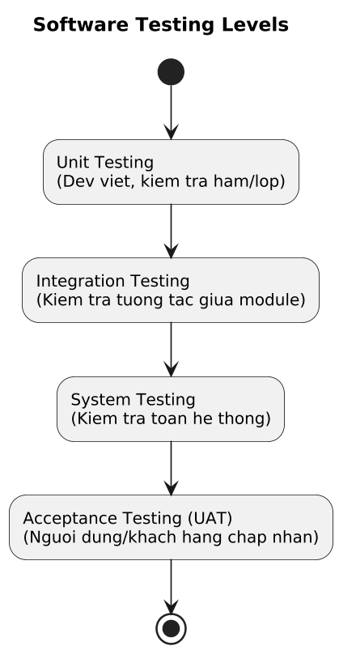
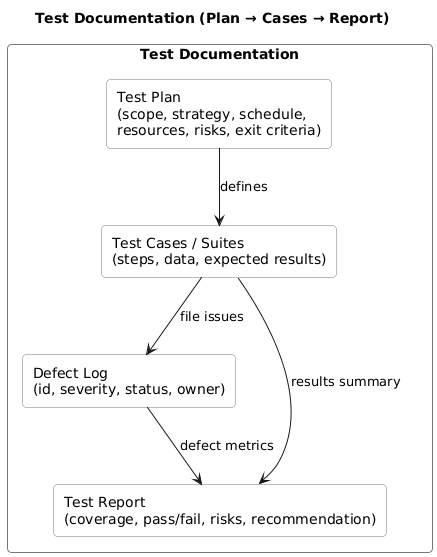

# Lecture 05 — Software Testing 
Repo **se-lecture05-testing-N23DCPT077** — môn *Nhập Môn Công Nghệ Phần Mềm*.

## Quick links
- 📄 **Bài giải (Markdown):** [`answers/Lecture05-Testing-Answers.md`](answers/Lecture05-Testing-Answers.md)
- 🖨️ **Bài giải (PDF để nộp):** [`answers/Lecture05-Testing-Answers.pdf`](answers/Lecture05-Testing-Answers.pdf)

## Diagrams (PNG)
> Click để xem full size. PNG export từ PlantUML.
- **V-Model**
  
  

- **Testing Levels**
  
  

- **Test Documentation Map**
  
  

## Repo structure
├─ README.md
├─ answers/
│ ├─ Lecture05-Testing-Answers.md
│ └─ Lecture05-Testing-Answers.pdf
├─ Vmodel-lecture05testing.png
├─ TestingLevel-lecture05testing.png
└─ testdoc-lecture05Testing.png

## Ghi chú học tập nhanh
- Levels: Unit → Integration → System → Acceptance (UAT).
- V-Model: mỗi pha dev ánh xạ 1 pha test (Req ↔ UAT, System Design ↔ System Test, Architecture ↔ Integration, Module ↔ Unit).
- Tài liệu test cốt lõi: **Test Plan, Test Cases, Defect Log, Test Report**.
